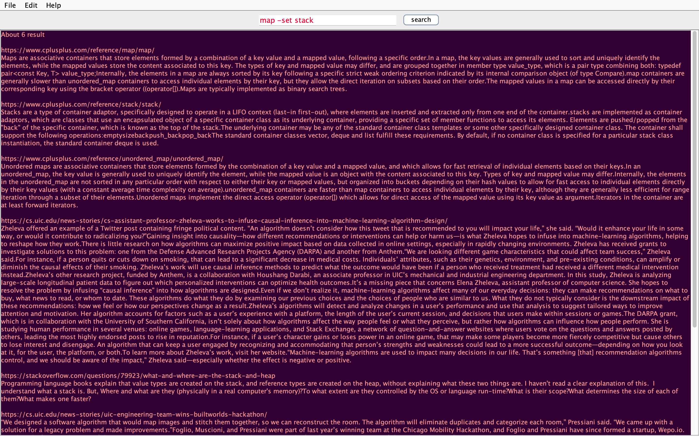

<!-- @format -->

# Search-Engine-Java

---

## This Search Engine project is an extension of the C++ "Min-Search-Engine" program's concept. However, this application will be a Java GUI program.

- It is not clear from the given information what specific features or capabilities the Search Engine will have. However, some common features of search engines include:

  - Keyword search: the ability to search for specific words or phrases within a set of documents or web pages.
  - Boolean search: the ability to use logical operators such as "AND," "OR," and "NOT" to combine or exclude search terms.
  - Wildcard search: the ability to use special characters such as "\*" or "?" to match multiple characters or represent missing characters in a search term.
  - Fuzzy search: the ability to find results that are similar to, but not exactly the same as, the search term.
  - Phrase search: the ability to find results that contain an exact phrase, rather than just individual words.
  - Stemming: the ability to find results that contain different forms of a word, such as singular and plural forms.
  - Synonym search: the ability to find results that contain synonyms of the search term.

- The Java GUI of the Search Engine may include additional features such as:
  - A search bar or text field for users to enter their search queries.
  - Buttons or other controls to submit a search, clear the search field, or access advanced search options.
  - A list or grid of search results, including titles, descriptions, and potentially other metadata such as dates, authors, or categories.
  - Controls for sorting, filtering, or grouping the search results.
  - Links or buttons to view or interact with the search results, such as opening a web page or saving an item to a bookmark list.
  - A navigation menu or other options for accessing additional features or settings of the Search Engine.
- Depending on the specific requirements of the Search Engine project, it may involve retrieving data from a variety of sources such as web pages, databases, or local files. It may also involve parsing and indexing the data to make it more easily searchable, and storing the results in a way that allows for fast and efficient retrieval.

---

Launch your Terminal and clone the repository. Clone it by using following command:

```
git clone https://github.com/UBakaliya/Search-Engine-Java.git
```

After downloading the application, identify the place where it was downloaded to get started.

Call `make all` on your console to start the program. Enjoy 😉.

- Here is a screenshot of the application in action:

---

## Start Page:


---

## Institutions page:


---

## Query Search:


---

## More Query Search:


