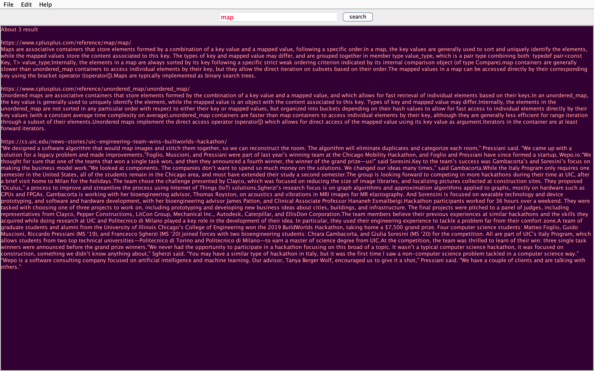

<!-- @format -->

# Search Engine
This Search Engine is an extension of the C++ "Min-Search-Engine" program's concept, written in Java and featuring a GUI interface. In addition to displaying the URLs of search results, this application also displays the body text of the URLs and allows users to change the color scheme of the interface.

## Features
- Search the web using keywords or phrases
- View the body text of URLs in search results
- Customize the color scheme of the interface
- Open multiple file at once to search
- Java GUI interface


## Requirements
- Java 8 or higher
- An internet connection

# Installation
- To run the Search Engine, you will need to have Java 8 or higher installed on your machine. Once you have Java installed, you can download the Search - - Engine program files from this repository using the following command:
```
git clone https://github.com/UBakaliya/Search-Engine.git
```
---
## Usage
To use the Search Engine, simply enter your search query in the input field and click the "Search" button. The application will retrieve and display the search results, including the body text of the URLs, in the results panel. You can customize the color scheme of the interface by clicking on the "Settings" button and selecting your preferred color scheme.


## Contributions
We welcome contributions to the Search Engine project. If you have an idea for a new feature or have found a bug that you would like to fix, please feel free to open a pull request or issue on the repository.


## License
This project is licensed under the Uvaish Bakaliya license. See the LICENSE file for more information.

---
## Program is action:
After downloading the application, identify the place where it was downloaded to get started.

Double click on `Search Engine.jar` start the program. Enjoy 😉.

- Here is a screenshot of the application in action:

---

## Start Window:


---

## Instructions Window:


---

## Query Search:



---

## More Query Search:


## More More Query Search:


